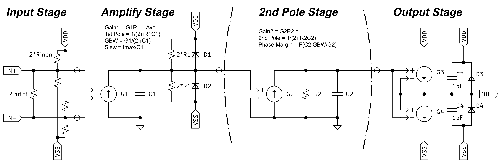

[日本語はこちら](README_jp.md)
# Universal Opamp Model for ngspice

An ngspice-compatible universal op-amp model, providing functionality similar to LTspice's UniversalOpamp (Level 3a).

## 1. Equivalent Circuit


This model is based on the following resources:

* [Mastering Electronics Design - Building an Op-Amp SPICE Model](https://masteringelectronicsdesign.com/buildi-an-op-amp-spice-model-from-its-datasheet/)
* [eCircuitCenter - Opamp Models](https://www.ecircuitcenter.com/OpModels/OpampModels.htm)
* [Imperial College London - Lecture 4: Understanding Op-amp Models](http://www.ee.ic.ac.uk/pcheung/teaching/EE2_CAS/)

## 2. Features
* **Dual Pole Models**: Supports both 1-pole model (`UniversalOpAmp2`) and 2-pole model (`UniversalOpAmp3a`).
* **LTspice Compatibility**: Similar to LTspice's Universal Opamp Model Level 3a (excluding noise analysis).
* **Output Impedance Support**: Supports Open-Loop Output Impedance ($R_{out}$).
* **KiCAD Compatible**: Pin-compatible with KiCAD's `Simulation_SPICE/OPAMP` models.

## 3. Requirements
* [ngspice](https://ngspice.sourceforge.net/)

## 4. Quick Start
test.cir\:
```
.title MCP6021 Open Loop Gain = -V(n_out)/V(n_in)
.include "UniversalOpAmp4NGS.lib"
.save V(n_in)
.save V(n_out)
.ac dec 100 1 100Meg

V1  n_in n_out  DC 0 SIN( 0 0 1k 0 0 0 ) AC 1
R1  n_out 0  10k
C1  n_out 0  60p
XU1 0 n_in n004 n005 n_out  UniversalOpAmp3a
+ Avol=1.1Meg GBW=11.5Meg Slew=7Meg Vos=500uV ilimit=22mA
+ railp=15mV railn=10mV Ron=20 Rout=115 Rincm=1e13 Rindiff=1e13
+ phimargin=89
V2  n004 0  DC 2.5
V3  0 n005  DC 2.5

.end
```

Exec:
```bash
ngspice -b -r test.tmp -o test.log test.cir
```

## 5. Parameters

| Parameter | Description | Unit |
| :--- | :--- | :--- |
| `Avol` | Open-Loop voltage Gain | [V/V] |
| `GBW` | Gain Bandwidth Product | [Hz] |
| `Slew` | Slew rate | [V/sec] |
| `Vos` | Input offset voltage | [V] |
| `ilimit` | Output short circuit current | [A] |
| `railp` | Gap from max output to V+ | [V] |
| `railn` | Gap from min output to V- | [V] |
| `Ron` | On-resistance of output transistor | [$\Omega$] |
| `Rout` | Open-Loop output impedance | [$\Omega$] |
| `Rincm` | Common-Mode Input impedance | [$\Omega$] |
| `Rindiff` | Differential Input impedance | [$\Omega$ |
| `phimargin` | Phase margin (2-pole model only) | [deg] |

## 6. License
[MIT License](LICENSE)
